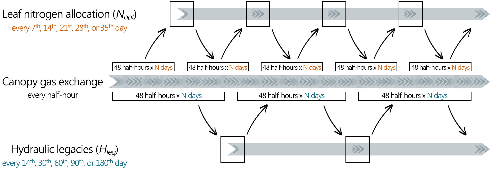

# Predicting resilience through the lens of competing adjustments to vegetation function

Manon E. B. Sabot, Martin G. De Kauwe, Andy J. Pitman, David S. Ellsworth,
Belinda E. Medlyn, Silvia Caldararu, Sönke Zaehle, Kristine Y. Crous,
Teresa E. Gimeno, Agnieszka Wujeska-Klause, Mengyuan Mu, and Jinyan Yang.

## Overview

Repository containing all the code to reproduce the results in
Sabot et al. (2022): Predicting resilience through the lens of competing
adjustments to vegetation function. Plant, Cell, & Environment, Accepted.

[](https://zenodo.org/badge/latestdoi/459691377)

&nbsp;

## General instructions

⚠ Only the model and analysis codes are stored in this github repository.
If you also want to access the data files, they are available from
[zenodo](https://zenodo.org/badge/latestdoi/459691377).

&nbsp;

To make sure the model and support files are properly set up, simply type:
```
make -f setup.mk
```
> N.B.1: You need anaconda to use the existing environment files within which
> to run the model. By default, python 3.8 will be used to run the model.
> If you would rather install the dependencies locally, you will need python.

> N.B.2: There are issues with the automated install of the dominance-analysis
> package used in the analysis section, so it is commented out from the
> environment file. If you cannot easily install it, you can download
> [this file](https://github.com/dominance-analysis/dominance-analysis/raw/master/dominance_analysis/dist/dominance_analysis-1.0.0-py3-none-any.whl)
> into the current repository (i.e., `Competing_Optimal_Adjustments`) and then
> type `pip install dominance_analysis-1.0.0-py3-none-any.whl` in the command
> line, which should manage the install.

&nbsp;

If you have already setup the environment, simply type:
```
conda activate competing_opts
```

&nbsp;

To regenerate all our results and figures, type:

```
make
```

> N.B.1: In this demo version, the simulation scripts called by `Makefile` are
> setup to run on very CPUs (4 to 6 for most machines, depending on your
> machine). This will be very slow, so it would be worth adding defining a
> higher number of CPUs to use by parsing the -c N` argument after each of
> the `.sh` simulation scripts, shall you wish to recreate our results.

> N.B.2: In the current `Makefile`, the commands used to calibrate the input
> file parameters (in `preparation`) and to run the model simulations (in
> `simulations`) are commented out, as this takes a long time without
> parallelisation, and the outputs are already written to files stored in
> `input/` and `output/`

&nbsp;

To recalculate and recalibrate the model parameters alone, uncomment the
`Makefile` and type:

```
make preparation
```

To rerun the model simulations only, uncomment the `Makefile` and type:

```
make simulations
```

To perform the various analyses on the output again:

```
make analyses
```

Finally, to simply recreate our figures:

```
make plots
```

And to clean up old log files from the `src/tmp/` folder, type:
```
make clean
```

&nbsp;

## The model

The model used here is a new version of the **TractLSM**
([Sabot et al., 2019](https://doi.org/10.5281/zenodo.3566722)), which
originally only embedded a canopy gas exchange optimisation approach. The new
version of the model: (i) also includes a scheme that optimises leaf nitrogen
allocation, thus V<sub>cmax25</sub> and J<sub>max25</sub>; and (ii)
incorporates a representation of legacy effects from sustained hydraulic
damage.

Different model configurations can optimise canopy gas exchange, plus leaf
nitrogen allocation and/or hydraulic legacies over various timescales, as
summarised in the schematics below:

&nbsp;



&nbsp;

All our model experiments are detailed in the associated publication, and for
anyone interested, the code is thoroughly commented.

For more details on the model, you can also refer to
[`src/TractLSM/ReadMe`](src/TractLSM/ReadMe.md).

&nbsp;

## To go further...

If you wish to further explore model behaviour, simply make changes to
`src/irun.txt` (similar to a namelist) and type:

```
src/ExecTractLSM src/irun.txt
```
&nbsp;

## Data Files

Available from
[](https://zenodo.org/badge/latestdoi/459691377).

Please see [`input/ReadMe`](input/ReadMe.md) in the
[zenodo](https://zenodo.org/badge/latestdoi/459691377) repository for more
detail.

&nbsp;

## License

This project is licensed under the MIT License - see the [License](License)
file.

&nbsp;

## Contact

Manon Sabot: [m.e.b.sabot@gmail.com](mailto:m.e.b.sabot@gmail.com?subject=[Competing_Optimisations]%20Source%20Han%20Sans)
